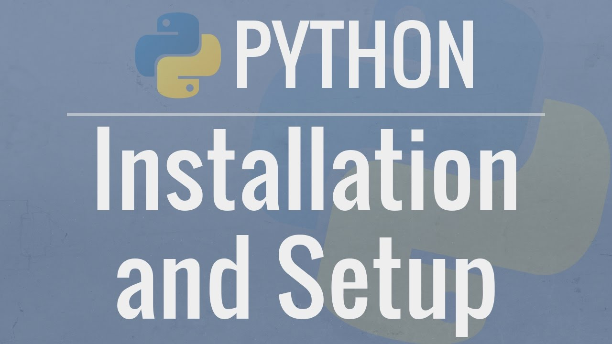
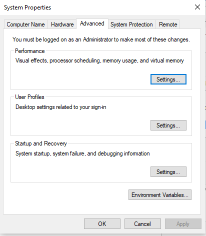
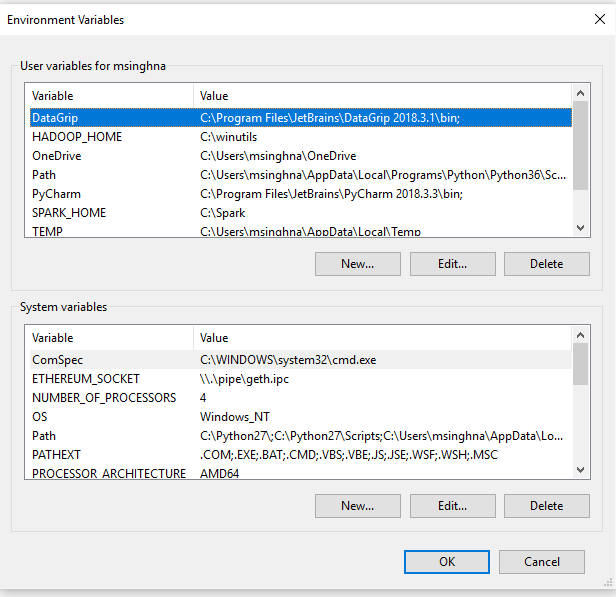
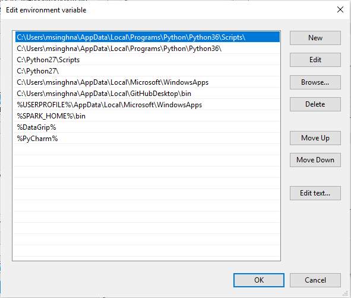

# Python Introduction

 

Python is not usually included by default on Windows, however we can check if any version exists on the system. Open the command line–a text-only view of your computer–via PowerShell which is a built-in program.

Go to Start Menu and type “PowerShell” to open it.

Type the following command and hit the Enter/Return key:

 python --version
 Python 2.7.12

 If you see output like this, Python is already installed. But most likely it is not. So…let’s install Python.

## 1. which version of python to install on windows system ?

You can visit the official Python website <a href='https://www.python.org/downloads/windows/'> download </a> page, you will see the two versions 2.x and 3.x. Currently at this point of time we have 2.7.15 and 3.7.2 Versions available. Python 2.x will not be updated by community after 2020 so will prefer if you start your coding with Python 3.

One bit of background for those of you unfamiliar with the Python ecosystem – Python 2.7.* and Python 3.* are totally different animals, and the majority of the Python OSS and package ecosystem still hasn’t caught up to using Python 3 yet.

This installer will install the appropriate 32-bit or 64-bit version on your computer automatically (here’s some further reading if you want to know more about the differences between the two).

## 2. Installing Python 2.7 ?

As per python documentation for Installation refer this <a href='https://docs.python.org/2/using/windows.html#installing-python'> link </a> . After downloading the installer install it on your system.

## 3. Add the Python 2.7 Directory to your System Path Environment Variable

In order to make it so you can access Python via any command line prompt (and not just the Python-specific one), you’ll need to add the newly-installed Python 2.7 directory to your “Path” system environment variable. This makes it easier to access Python and run scripts in whatever shell you’re using to using (Command Prompt, PowerShell, and my personal favorite: Git Bash.)

So, hit to window button and type environment variables and click on the link which comes forward. After that a dialog box will appear to ask yes or No click on Yes and proceed than a window panel will open and cllck on environment variable button. and select the PATH variable from the list below:

 

 

 

And append the Python path to the end of the string – the default path will be something like C:\Python27.

Also make sure you include the C:\Python27\Scripts in the Path too even if it doesn’t exist yet – this is where your package management tools, unit testing tools, and other command line-accessible Python programs will live.

## Install pip to Manage Your Python Packages

There’s a couple of different options for package management in Python – pip is the one that doesn’t suck.

Pip makes it trivial for us to install Python packages, like Requests. And we’re going to have to install packages pretty often if we’re working with third party tools and libraries, so this is a must-have.

Pip has a detailed set of instructions on how to install it from source – if you don’t have the curl command on your system, just use your Git or even your web browser to download the source file mentioned in their instructions.

# Install Python 3 on Windows

Same process like 2.7

Go to the downloads section of the official Python website. Download the installer and make sure to click the box on the bottom of the page for the Add Python 3.7 to PATH option, which will let use python directly from terminal. Otherwise we’d have to enter our system’s full path and modify our environment variables manually. In other words, it’ll be a nightmare. Trust me. Check click the box and you’ll save yourself a world of headache.

After Python has installed close PowerShell. Then re-open it and try our command again. You should see the following:

python --version
Python 3.7.0

The version number might be slightly different than mine, 3.7.0, but the important thing is that Python 3 is now installed!

To prove it to yourself, trying typing python to open the Python interpreter. And then type print("Hello, World") and hit Enter/Return. It should print out Hello, World on a new line.

$ python
>>> print("Hello, World")
Hello, World

# Thanks !!!

## Furthermore, if you have any query, feel free to ask in the comment section.
