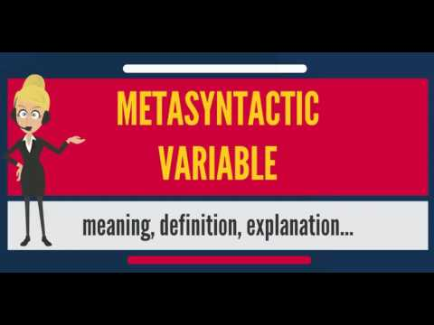

# Metasyntactic Variable

 

# Lets first discuss what is Metasyntactic Variable ?

As per Wikipedia : A metasyntactic variable is a specific word or set of words identified as a placeholder in computer science and specifically computer programming. These words are commonly found in source code and are intended to be modified or substituted to be applicable to the specific usage before compilation (translation to an executable). The words foo and bar are good examples.

Metasyntactic variables are used to name entities such as variables, functions, and commands whose exact identity is unimportant and serve only to demonstrate a concept, which is useful for teaching programming

## foobar Origin

 

We all when done work on some programming languages we might encounter with metasyntactic variables in life such as foo and bar. Did it ever encounter to your mind that why are we using these variables in programming.

Let's discuss today

<b> As per wikipedia: </b> The terms foo-bar (/ˈfuːbɑːr/), or foo and others are used as placeholder names (also referred to as metasyntactic variables) in computer programming or computer-related documentation.[1] They have been used to name entities such as variables, functions, and commands whose exact identity is unimportant and serve only to demonstrate a concept.

## History

"Foo" and "bar" as metasyntactic variables were popularised by MIT and DEC, the first references are in work on LISP and PDP-1 and Project MAC from 1964 onwards.

Many of these people were in MIT's Tech Model Railroad Club, where we find the first documented use of "foo" in tech circles in 1959 (and a variant in 1958).

Both "foo" and "bar" (and even "baz") were well known in popular culture, especially from Smokey Stover and Pogo comics, which will have been read by many TMRC members.

Also, it seems likely the military FUBAR contributed to their popularity.

The first known use of the terms in print in a programming context appears in a 1965 edition of MIT's Tech Engineering News.[4] Foobar may have come about as a result of the pre-existing "Foo" being conjoined with "bar", an addition borrowed from the military's FUBAR. The use of foo in a programming context is generally credited to the Tech Model Railroad Club (TMRC) of MIT from circa 1960.[1] In the complex model system, there were scram switches located at numerous places around the room that could be thrown if something undesirable was about to occur, such as a train going full-bore at an obstruction. Another feature of the system was a digital clock on the dispatch board. When someone hit a scram switch, the clock stopped and the display was replaced with the word "FOO"; at TMRC the scram switches are, therefore, called "Foo switches". Because of this, an entry in the 1959 Dictionary of the TMRC Language went something like this: "FOO: The first syllable of the misquoted sacred chant phrase 'foo mane padme hum.' Our first obligation is to keep the foo counters turning."[5] One book[which?] describing the MIT train room describes two buttons by the door: labeled "foo" and "bar". These were general purpose buttons and were often re-purposed for whatever fun idea the MIT hackers had at the time, hence the adoption of foo and bar as general purpose variable names. An entry in the Abridged Dictionary of the TMRC Language states

# Thanks !!!

## Furthermore, if you have any query, feel free to ask in the comment section.
