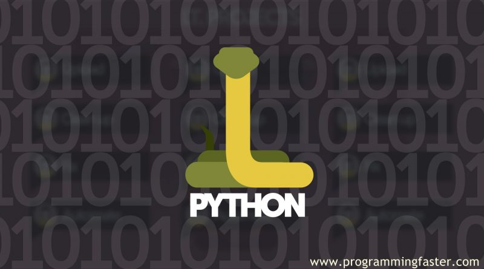
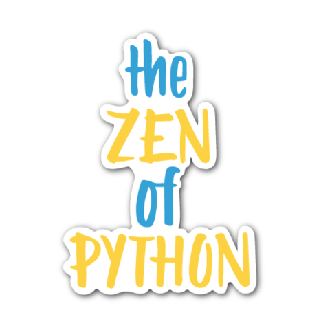

# Python History

 

What do the alphabet and the programming language Python have in common? Right, both start with ABC. If we are talking about ABC in the Python context, it's clear that the programming language ABC is meant. ABC is a general-purpose programming language and programming environment, which had been developed in the Netherlands, Amsterdam, at the CWI (Centrum Wiskunde & Informatica). The greatest achievement of ABC was to influence the design of Python.

Python was conceptualized in the late 1980s. Guido van Rossum worked that time in a project at the CWI, called Amoeba, a distributed operating system. In an interview with Bill Venners1, Guido van Rossum said: "In the early 1980s, I worked as an implementer on a team building a language called ABC at Centrum Wiskunde and Informatica (CWI). I don't know how well people know ABC's influence on Python. I try to mention ABC's influence because I'm indebted to everything I learned during that project and to the people who worked on it."

Later on in the same Interview, Guido van Rossum continued: "I remembered all my experience and some of my frustration with ABC. I decided to try to design a simple scripting language that possessed some of ABC's better properties, but without its problems. So I started typing. I created a simple virtual machine, a simple parser, and a simple runtime. I made my own version of the various ABC parts that I liked. I created a basic syntax, used indentation for statement grouping instead of curly braces or begin-end blocks, and developed a small number of powerful data types: a hash table (or dictionary, as we call it), a list, strings, and numbers."

## How About Python Name

So, what about the name "Python": Most people think about snakes, and even the logo depicts two snakes, but the origin of the name has its root in British humour. Guido van Rossum, the creator of Python, wrote in 1996 about the origin of the name of his programming language1: "Over six years ago, in December 1989, I was looking for a 'hobby' programming project that would keep me occupied during the week around Christmas. My office ... would be closed, but I had a home computer, and not much else on my hands. I decided to write an interpreter for the new scripting language I had been thinking about lately: a descendant of ABC that would appeal to Unix/C hackers. I chose Python as a working title for the project, being in a slightly irreverent mood (and a big fan of Monty Python's Flying Circus)."

 

## Zen of Python

- Beautiful is better than ugly.
- Explicit is better than implicit.
- Simple is better than complex.
- Complex is better than complicated.
- Flat is better than nested.
- Sparse is better than dense.
- Readability counts.
- Special cases aren't special enough to break the rules.
- Although practicality beats purity.
- Errors should never pass silently.
- Unless explicitly silenced.
- In the face of ambiguity, refuse the temptation to guess.
- There should be one -- and preferably only one -- obvious way to do it.
- Although that way may not be obvious at first unless you're Dutch.
- Now is better than never.
- Although never is often better than *right* now.
- If the implementation is hard to explain, it's a bad idea.
- If the implementation is easy to explain, it may be a good idea.
- Namespaces are one honking great idea -- let's do more of those!

## Development Steps towards Python

Guido Van Rossum published the first version of Python code (version 0.9.0) at alt.sources in February 1991. This release included already exception handling, functions, and the core data types of list, dict, str and others. It was also object oriented and had a module system.

Python version 1.0 was released in January 1994. The major new features included in this release were the functional programming tools lambda, map, filter and reduce, which Guido Van Rossum never liked.

Six and a half years later in October 2000, Python 2.0 was introduced. This release included list comprehensions, a full garbage collector and it was supporting Unicode.

Python flourished for another 8 years in the versions 2.x before the next major release as Python 3.0 (also known as "Python 3000" and "Py3K") was released. Python 3 is not backwards compatible with Python 2.x. The emphasis in Python 3 had been on the removal of duplicate programming constructs and modules, thus fulfilling or coming close to fulfilling the 13th law of the Zen of Python: "There should be one -- and preferably only one -- obvious way to do it."

### Some changes in Python 3.0:

- Print is now a function
- Views and iterators instead of lists
- The rules for ordering comparisons have been simplified. E.g. a heterogeneous list cannot be sorted, because all the elements of a list must be comparable to each other.
- There is only one integer type left, i.e. int. long is int as well.
- The division of two integers returns a float instead of an integer. "//" can be used to have the "old" behaviour.
- Text Vs. Data Instead Of Unicode Vs. 8-bit

# Thanks !!!

## Furthermore, if you have any query, feel free to ask in the comment section.
