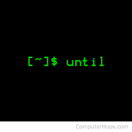
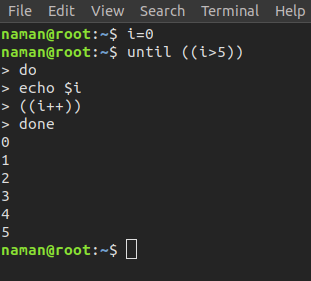

# Linux Until Command

 

until command in Linux used to execute a set of commands as long as the final command in the ‘until’ Commands has an exit status which is not zero. It is mostly used where the user needs to execute a set of commands until a condition is true.

### Syntax:
        until COMMANDS; do COMMANDS; done

Here, if the COMMANDS get evaluated to false then the statements will be executed. If the COMMANDS get evaluated to true then the no statements will be executed and control will go after the done statement.

### Example:

# Thanks !!!

## Furthermore, if you have any query, feel free to ask in the comment section.
