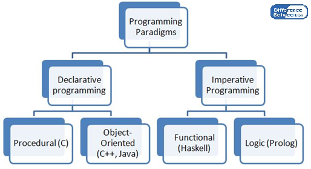

# Imperative Programming

 

Imperative programming is a paradigm of computer programming in which the program describes a sequence of steps that change the state of the computer. Unlike declarative programming, which describes "what" a program should accomplish, imperative programming explicitly tells the computer "how" to accomplish it. Programs written this way often compile to binary executables that run more efficiently since all CPU instructions are themselves imperative statements.

To make programs simpler for a human to read and write, imperative statements can be grouped into sections known as code blocks. In the 1950s, the idea of grouping a program's code into blocks was first implemented in the ALGOL programming language. They were originally called "compound statements," but today these blocks of code are known as procedures. Once a procedure is defined, it can be used as a single imperative statement, abstracting the control flow of a program and allowing the developer to express programming ideas more naturally. This type of imperative programming is called procedural programming, and it is a step towards higher-level abstractions such as declarative programming.

#                               Imperative programming languages

- [Ada](https://en.wikipedia.org/wiki/Ada_(programming_language)
- [ALGOL](https://en.wikipedia.org/wiki/ALGOL_68)
- [Assembly language](https://en.wikipedia.org/wiki/Assembly_language)
- [BASIC](https://en.wikipedia.org/wiki/BASIC)
- [C](https://en.wikipedia.org/wiki/C_(programming_language)
- [C#](https://en.wikipedia.org/wiki/C_Sharp_(programming_language)
- [C++](https://en.wikipedia.org/wiki/C%2B%2B)
- [COBOL](https://en.wikipedia.org/wiki/COBOL)
- [D](https://en.wikipedia.org/wiki/D_(programming_language)
- [FORTRAN](https://en.wikipedia.org/wiki/Fortran)
- [Go](https://en.wikipedia.org/wiki/Go_(programming_language)
- [Groovy](https://en.wikipedia.org/wiki/Apache_Groovy)
- [Java](https://en.wikipedia.org/wiki/Java_(programming_language)
- [Julia](https://en.wikipedia.org/wiki/Julia_(programming_language)
- [Lua](https://en.wikipedia.org/wiki/Lua_(programming_language)
- [MATLAB](https://en.wikipedia.org/wiki/MATLAB)
- [Modula](https://en.wikipedia.org/wiki/Modula)
- [MUMPS](https://en.wikipedia.org/wiki/MUMPS)
- [Nim](https://en.wikipedia.org/wiki/Nim_(programming_language)
- [Oberon](https://en.wikipedia.org/wiki/Oberon_(programming_language)
- [OCaml](https://en.wikipedia.org/wiki/OCaml)
- [Pascal](https://en.wikipedia.org/wiki/Pascal_(programming_language)
- [Perl](https://en.wikipedia.org/wiki/Perl)
- [PHP](https://en.wikipedia.org/wiki/PHP)
- [PROSE](https://en.wikipedia.org/wiki/ProSet)
- [Python](https://en.wikipedia.org/wiki/Python_(programming_language)
- [Ruby](https://en.wikipedia.org/wiki/Ruby_(programming_language)
- [Rust](https://en.wikipedia.org/wiki/Rust_(programming_language)

# Thanks !!!

## Furthermore, if you have any query, feel free to ask in the comment section.
