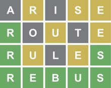

# Wordle Game

 

As per Wiki Definition: Wordle is a web-based word game developed by Josh Wardle. Players have six attempts to guess a five-letter word, with feedback given for each guess in the form of colored tiles indicating when letters match or occupy the correct position. The mechanics are nearly identical to the 1955 pen-and-paper game Jotto and the US television game show Lingo. Wordle has a single daily solution, with all players attempting to guess the same word.

Wardle initially created the game for himself and his partner to play, eventually making it public in October 2021, The game gained a large amount of popularity in December 2021, after Wardle added the ability for players to copy their daily results as emoji squares, which were widely shared on Twitter. Many clones and variations of the game were also created, as were versions in languages besides English. The game was purchased by The New York Times Company in January 2022 for an undisclosed seven-figure sum, with plans to initially keep it free for all players.

#                               Wordle Answer Sheet

## Feb

- Feb 12 - #238 - ULTRA
- Feb 11 - #237 - ULCER
- Feb 10 - #236 - PAUSE
- Feb 09 - #235 - HUMOR
- Feb 08 - #234 - FRAME
- Feb 07 - #233 - ELDER
- Feb 06 - #232 - SKILL
- Feb 05 - #231 - ALOFT
- Feb 04 - #230 - PLEAT
- Feb 03 - #229 - SHARD
- Feb 02 - #228 - MOIST
- Feb 01 - #227 - THOSE

## Jan

Listed below is every single Wordle word from January 2022.

- Jan 01 - #196 - REBUS
- Jan 02 - #197 - BOOST
- Jan 03 - #198 - TRUSS
- Jan 04 - #199 - SIEGE
- Jan 05 - #200 - TIGER
- Jan 06 - #201 - BANAL
- Jan 07 - #202 - SLUMP
- Jan 08 - #203 - CRANK
- Jan 09 - #204 - GORGE
- Jan 10 - #205 - QUERY
- Jan 11 - #206 - DRINK
- Jan 12 - #207 - FAVOR
- Jan 13 - #208 - ABBEY
- Jan 14 - #209 - TANGY
- Jan 15 - #210 -  PANIC
- Jan 16 - #211 - SOLAR
- Jan 17 - #212 - SHIRE
- Jan 18 - #213 - PROXY
- Jan 19 - #214 - POINT
- Jan 20 - #215 - ROBOT
- Jan 21 - #216 - PRICK
- Jan 22 - #217 - WINCE
- Jan 23 - #218 - CRIMP
- Jan 24 - #219 - KNOLL
- Jan 25 - #220 - SUGAR
- Jan 26 - #221 - WHACK
- Jan 27 - #222 - MOUNT
- Jan 28 - #223 - PERKY
- Jan 29 - #224 - COULD
- Jan 30 - #225 - WRUNG
- Jan 31 - #226 - LIGHT

# Thanks !!!

## Furthermore, if you have any query, feel free to ask in the comment section.
